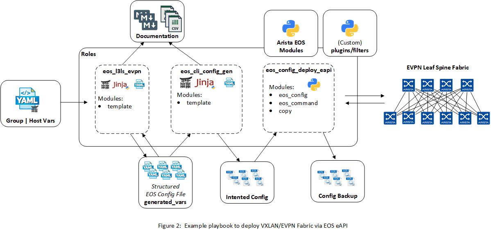
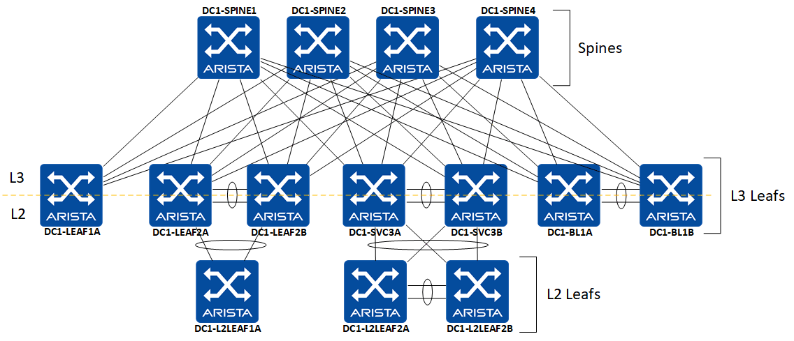

__Note:__ Ansible Validated Design demo Work in Progress.  Master branch should always run as is.

# Intro to This Repo
A more simplified & commented version of [arista-evpn-webinar-june-11](https://github.com/aristanetworks/netdevops-examples/tree/evpn-webinar-june-11/ansible/avd-evpn-l3ls-1) using the [eos_l3ls_vpn README.md](https://github.com/aristanetworks/ansible-avd/tree/devel/ansible_collections/arista/avd/roles/eos_l3ls_evpn) where the demo was not quite clear or overly complex for someone getting started.

## Initial Thoughts to the Arista Approach

Overall Thoughts:
 - I like the approach and especially the `eos_config_deploy_eapi` role.  It should have full EOS syntax coverage for all recent OS 4.22+ & it is supported as P3/4 by Arista.
 - [aristanetworks](https://github.com/aristanetworks) & [arista-netdevops-community](https://github.com/arista-netdevops-community) have done a great job, but really need to work on organization of repos, removing items that prevent getting started quickly (vault partially setup, multiple copies of the same examples with subtle differences that make a huge difference to getting started, knowing which version of their example is the latest)

EVPN vs VxLAN with manual flooding:
 - For my personal needs.  EVPN does not necessarily need to be deployed with VxLAN.
 - If no VxLAN stretches beyond 2 sites in a region & 1 vrf is maintained in the L3 Leaf & Spine infra, it just adds unneeded complexity if you have no need for managing segregation of tenant routing tables.
 - Manual VxLAN/VTEP Flooding works with automation assuming your VxLAN config base config and logic is solid.
 - Leaf & Spine Role would be useful to separate from the consolidate role L3 Leaf & Spine EVPN role.

Inventory:
 - I understand YAML, but the use of inventory.yaml tripped me up.
 - Its not much different than outputs from inventory plugins or json, but I am just so used to hello world / intro type examples to leverage a ini file for host inventory.

Structure & Role Generated Files:
 - Documentation output is a nice touch that @carlbuchmann started before he joined Arista.  I have looked to do the same in my own approach.
 - Structured config files make total sense, & they feel like they should belong as host_vars for each device.
 - I assume the reason structured config files are not maintained in the host_vars folders is probably so you can alter your host_vars as needed to track the generation of new structured config. 
 - Another approach to keep the above intention of separating abstraction/topology/function generated intended config from the host & group vars it used to generate intended configs would be to separate & move the "generate device intended config and documentation" task of the play and its associated directory structure to a separate directory/repo and its own playbook.  Basically you could drop avd-evpn-l3ls generated structured configs into the host_vars of the "device_config-deploy" repo's host_vars and also update/overwrite a `hosts/<fabric-name>.yml` for any fabric abstractions that were generated. (I likely need to articulate this better, and this is not supported given the expected directory structure in the eos_config_deploy_eapi role).

Next Steps:
 - Layer in batfish validation
 - Layer in pytest validation

# Ansible Arista Validated Design

Repository provides modules and roles to build an EVPN/VXLAN fabric using Ansible to build and deploy configuration to devices.

Devices configuration are based on [Arista EVPN Design Guide](https://www.arista.com/en/solutions/design-guides) and cover a generic Unified Cloud Network environment.



## Lab Topology

The Lab topology consists of four spines, seven L3 leafs and and three L2 Leafs, deployed on vEOS-LAB.



## Quick Start

```shell
# Install Python requirements
$ pip3 install -r requirements.txt

# Install arista collections
$ ansible-galaxy collection install arista.avd

# Edit Inventory file
$ vi inventory.yml

# Edit fabric variables
# Change values to point to your own information
$ vi group_vars/DC1_FABRIC.yml

# Run ansible playbooks
$ cd ansible/avd-evpn-l3ls/
$ ansible-playbook dc-fabric-config.yml --tags "build"
```

## Requirements

- Python: `3.x`
- [Ansible](https://www.ansible.com/): `2.9`
- [Arista Validated Design Collection](https://galaxy.ansible.com/arista/avd): `v1.0.0`

## Step by Step demo

__Generate EOS configuration__

This step generate following elements:

- [EOS Structure configuration](intended/structured_configs/)
- [EOS Configuration files](intended/configs/)
- [Fabric documentation](documentation/)

```shell
$ ansible-playbook dc-fabric-config.yml --tags build
PLAY [Build Switch configuration]
[...]

PLAY RECAP
DC1-BL1A                   : ok=5    changed=0    unreachable=0    failed=0
DC1-BL1B                   : ok=5    changed=0    unreachable=0    failed=0
DC1-L2LEAF1A               : ok=5    changed=0    unreachable=0    failed=0
DC1-L2LEAF2A               : ok=5    changed=0    unreachable=0    failed=0
DC1-L2LEAF2B               : ok=5    changed=0    unreachable=0    failed=0
DC1-LEAF1A                 : ok=5    changed=0    unreachable=0    failed=0
DC1-LEAF2A                 : ok=5    changed=1    unreachable=0    failed=0
DC1-LEAF2B                 : ok=5    changed=1    unreachable=0    failed=0
DC1-SPINE1                 : ok=8    changed=0    unreachable=0    failed=0
DC1-SPINE2                 : ok=5    changed=0    unreachable=0    failed=0
DC1-SPINE3                 : ok=5    changed=0    unreachable=0    failed=0
DC1-SPINE4                 : ok=5    changed=0    unreachable=0    failed=0
DC1-SVC3A                  : ok=5    changed=0    unreachable=0    failed=0
DC1-SVC3B                  : ok=5    changed=0    unreachable=0    failed=0

Sunday 19 July 2020  12:39:47 -0400 (0:00:02.426)       0:00:09.728 *********** 
=============================================================================== 
eos_cli_config_gen ------------------------------------------------------ 5.07s
eos_l3ls_evpn ----------------------------------------------------------- 4.63s
~~~~~~~~~~~~~~~~~~~~~~~~~~~~~~~~~~~~~~~~~~~~~~~~~~~~~~~~~~~~~~~~~~~~~~~~~~~~~~~ 
total ------------------------------------------------------------------- 9.70s
Sunday 19 July 2020  12:39:47 -0400 (0:00:02.426)       0:00:09.728 *********** 
=============================================================================== 
arista.avd.eos_cli_config_gen : Generate device documentation --------------------------------------- 2.43s
arista.avd.eos_cli_config_gen : Generate eos intended configuration --------------------------------- 2.36s
arista.avd.eos_l3ls_evpn : Generate device configuration in structured format (yaml). --------------- 2.07s
arista.avd.eos_l3ls_evpn : Generate Fabric Topology in csv format. ---------------------------------- 1.16s
arista.avd.eos_l3ls_evpn : Generate EVPN fabric documentation in Markdown Format. ------------------- 0.68s
arista.avd.eos_l3ls_evpn : Generate Leaf and Spine Point-To-Point Links summary in csv format. ------ 0.47s
arista.avd.eos_cli_config_gen : include device intended structure configuration variables ----------- 0.29s
arista.avd.eos_l3ls_evpn : Include device structured configuration, that was previously generated. -- 0.24s
Playbook run took 0 days, 0 hours, 0 minutes, 9 seconds
```
